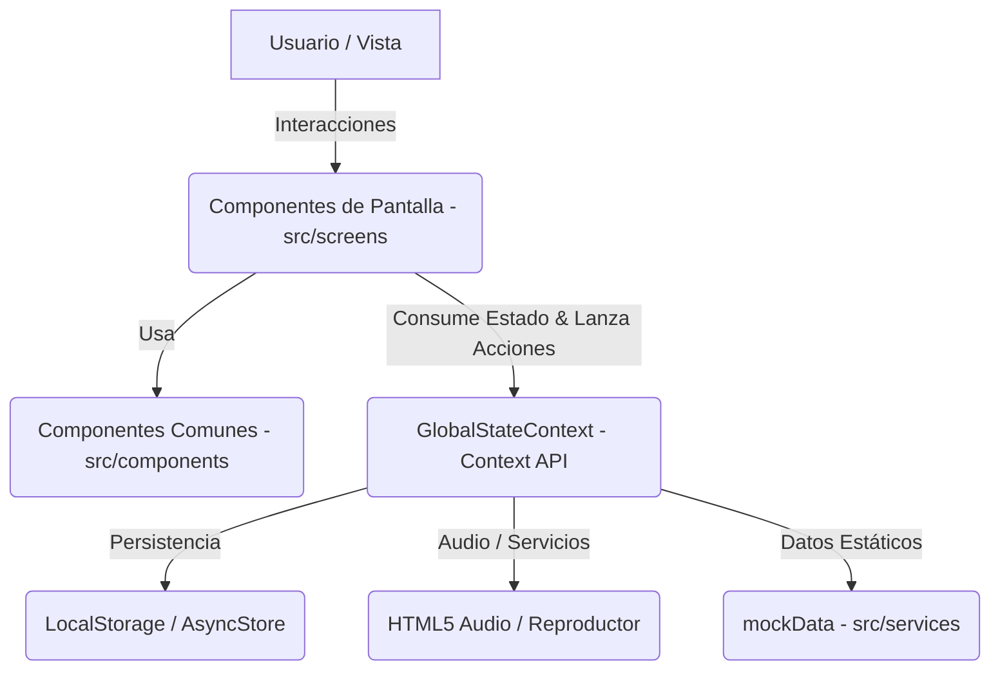

# Arquitectura de la Aplicación — Sabores 4.0

Este documento detalla la arquitectura, el diseño del sistema y los flujos de datos utilizados en la aplicación **Sabores 4.0**, un proyecto desarrollado en **Expo (React Native v56)** y optimizado tanto para dispositivos móviles (Android/iOS) como para la web (Vercel).

---

## 1. Vista General de la Arquitectura

La aplicación sigue una arquitectura frontend moderna basada en componentes reutilizables, modularidad TypeScript y gestión de estado reactiva unidireccional. 



### Tecnologías Clave:
*   **Core:** React 19 / React Native 0.85
*   **Framework de Entorno:** Expo v56.0.0
*   **Enrutamiento & Navegación:** Expo Router v56.2 (basado en carpetas)
*   **Gestión de Estado:** React Context API (con hooks personalizados)
*   **Tipado:** TypeScript estricto
*   **Estilos:** `StyleSheet` nativo con tokens de diseño unificados en un tema común

---

## 2. Estructura de Directorios

El código fuente de la aplicación se organiza bajo la carpeta `/src`, separando responsabilidades de enrutamiento, lógica de negocios, interfaces de usuario y utilidades:

```text
Sabores 4.0/
├── vercel.json                  # Configuración de despliegue y enrutamiento en Vercel
├── app.json                     # Configuración de Expo (metadatos, plugins, compilación)
├── package.json                 # Dependencias y scripts del proyecto
└── src/
    ├── global.css               # Estilos web globales
    ├── app/                     # Enrutador basado en archivos (Expo Router)
    │   ├── _layout.tsx          # Estructura base de navegación, reproductor global y Context Provider
    │   ├── index.tsx            # Ruta raíz (Inicio)
    │   ├── mapa.tsx             # Ruta del Mapa Interactivo
    │   ├── recetas.tsx          # Ruta del Recetario
    │   └── ...                  # Otras páginas (fiestas, trivia, perfil, etc.)
    ├── screens/                 # Vistas o páginas completas de la aplicación (Lógica principal)
    │   ├── Inicio.tsx
    │   ├── Recetas.tsx
    │   ├── Mapa.tsx
    │   └── ...
    ├── components/              # Componentes de UI reutilizables y atómicos
    │   ├── Card.tsx             # Tarjeta genérica con soporte para imágenes y texto
    │   ├── Header.tsx           # Cabecera de sección reutilizable
    │   ├── CustomTabBar.tsx     # Barra de navegación inferior personalizada con animaciones
    │   └── SkeletonLoader.tsx   # Animación de carga tipo esqueleto
    ├── services/                # Capa de datos, lógica de negocio y contexto global
    │   ├── GlobalStateContext.tsx # Proveedor de estado global (favoritos, reproductor, trivia, etc.)
    │   └── mockData.ts          # Datos locales mockeados (recetas, fiestas, audios)
    ├── theme/                   # Tokens del sistema de diseño
    │   └── index.ts             # Paleta de colores, espaciados, tipografías y sombras
    └── types/                   # Definiciones de tipos e interfaces TypeScript
        └── index.ts             # Modelos de datos (Recipe, Festival, MultimediaItem, etc.)
```

---

## 3. Enrutamiento y Navegación (Expo Router)

La navegación es gestionada de manera declarativa usando **Expo Router**. La estructura de carpetas en `src/app/` define automáticamente el árbol de navegación.

### Estructura de Navegación:
1.  **Punto de Entrada (`src/app/_layout.tsx`)**:
    *   Envuelve toda la aplicación en el `<GlobalStateProvider>` para asegurar que el estado persistente y del reproductor de audio esté disponible en cualquier parte.
    *   Define una navegación por pestañas (`<Tabs>`) usando un componente personalizado (`CustomTabBar`).
    *   Integra el **`FloatingGlobalPlayer`** (un reproductor de audio flotante e interactivo) que se sobrepone a las pantallas cuando hay un podcast o receta de audio en reproducción, excepto si el usuario está en la vista multimedia dedicada.
2.  **Rutas (`src/app/*.tsx`)**:
    *   Actúan como "shells" o adaptadores que importan y renderizan los componentes de pantalla reales de `src/screens/`. Esto desacopla la lógica de navegación basada en archivos de la vista principal del negocio.

---

## 4. Gestión de Estado Global (`GlobalStateContext.tsx`)

Debido a que la aplicación tiene características complejas de gamificación y reproducción multimedia continua, se utiliza un único **Global State Context** que centraliza:

*   **Persistencia:** Todos los estados interactivos (favoritos, historial de trivia, hotspots del mapa visitados, audios reproducidos) se sincronizan de manera transparente con el almacenamiento local (`localStorage` en web / persistible para móviles).
*   **Gamificación:** Almacenamiento de puntajes de la Trivia y lista de lugares turísticos o curiosidades descubiertas en el mapa.
*   **Tema Adaptativo:** Un estado `isDarkMode` que expone dinámicamente un conjunto de colores (paleta clara/oscura) consumibles directamente por el sistema de diseño de React Native.
*   **Reproductor de Audio Unificado:**
    *   Utiliza una instancia de `Audio` nativa de HTML5 para plataformas web, sincronizando eventos (`play`, `pause`, `ended`, `timeupdate`) con estados locales de React.
    *   Incluye un **motor de simulación de reproducción** para entornos nativos o de prueba, lo que garantiza que las barras de progreso, barras de animación de sonido y temporizadores funcionen siempre independientemente de la plataforma.

---

## 5. Sistema de Diseño y Estilos

La aplicación utiliza un sistema de diseño artesanal y adaptado a dispositivos móviles/web ubicado en [src/theme/index.ts](file:///c:/Users/Walter-Pc/Downloads/Sabores%204.0/src/theme/index.ts).

*   **Paleta de Colores:** Basada en tonos cálidos locales (Terracota, Verde Natural, Dorado Suave, Arena y Marfil).
*   **Sombras y Elevación:** Estilos adaptados con soporte para `shadowColor/shadowOpacity` en iOS/Web y `elevation` en Android.
*   **Uso del Tema:** Los componentes no importan valores estáticos directos; en su lugar, leen los tokens del `Theme` o consumen la propiedad `colors` expuesta por `useGlobalState()` para soportar el modo oscuro en tiempo real de forma dinámica.

---

## 6. Flujo de Datos y Modelos

Todos los datos están tipados estrictamente mediante contratos definidos en `src/types/index.ts`. Esto previene fallos en tiempo de ejecución.

### Principales Modelos:
*   **`Recipe` (Receta):** Define estructura de ingredientes, pasos, tiempos, dificultad e historia de los platos típicos correntinos.
*   **`Festival` (Fiesta Popular):** Vincula las fiestas provinciales con sus recetas típicas relacionadas, videos y galerías.
*   **`DepartmentHotspot` (Hotspot de Departamento):** Define la posición porcentual (`x`, `y`) dentro de la cuadrícula de coordenadas del mapa de Corrientes, además de platos locales e ingredientes oriundos de la zona.
*   **`MultimediaItem` (Audio/Podcast):** Utilizado para estructurar las pistas del reproductor global continuo.

---

## 7. Estrategia de Despliegue Web (Vercel)

Para la plataforma web, el proyecto se compila en un conjunto de archivos estáticos (SPA) mediante el comando `npx expo export -p web`.

La configuración de enrutamiento web se delega a Vercel mediante el archivo `vercel.json` en la raíz, que define un catch-all rewrite:
1.  Vercel recibe una petición para una sub-ruta (por ejemplo, `/trivia`).
2.  Dado que no existe una carpeta física `/trivia/index.html` en el export estático, Vercel aplica la regla de reescritura.
3.  Vercel sirve el archivo raíz `/index.html` sin cambiar la URL del navegador.
4.  **Expo Router** en el cliente lee la ruta `/trivia` y renderiza instantáneamente la pantalla correspondiente, evitando errores `404: NOT_FOUND`.
