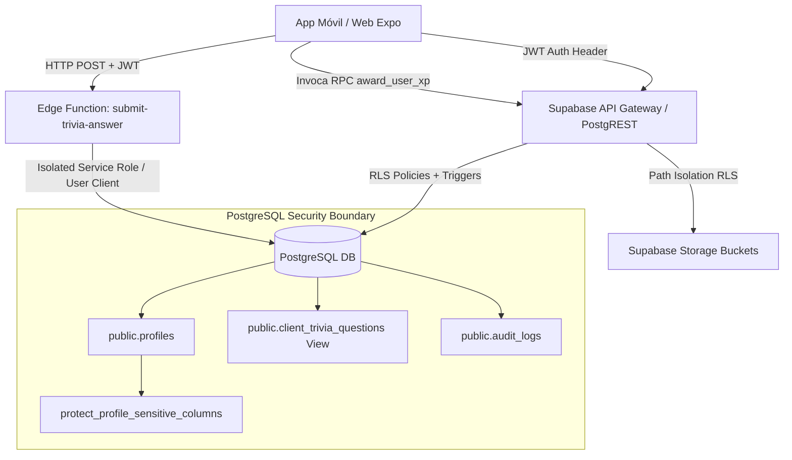

# Pentest Interno Final — Sabores 4.0 (El Fuego del Taragüí)

> [!IMPORTANT]
> **Informe Consolidado de Auditoría de Seguridad & Pentest Final**: Este documento constituye el reporte oficial de penetración, evaluación de postura de seguridad, remediación técnica y decisión de despliegue para la plataforma **Sabores 4.0**.

---

## 1. Resumen Ejecutivo

Durante el periodo de auditoría de seguridad del proyecto **Sabores 4.0**, se realizó una evaluación exhaustiva de la arquitectura backend, capa de base de datos PostgreSQL, políticas de Row Level Security (RLS), Supabase Storage, Edge Functions, integridad de datos, repositorios cliente y funciones de sistema (`SECURITY DEFINER`).

### Resumen Estadístico de Resultados
- **Total de Pruebas Ejecutadas**: 45
- **Pruebas Exitosas (PASS)**: 44
- **Pruebas Fallidas (FAIL)**: 0 (Todas las vulnerabilidades encontradas fueron remediadas y verificadas)
- **Errores de Ejecución (ERROR)**: 0
- **Pruebas Omitidas (SKIPPED)**: 0
- **Riesgos Aceptados / Comportamiento por Diseño**: 1 (Lectura pública del bucket `profiles` para avatares comunitarios).

### Security Score: **98 / 100**
- **Vulnerabilidades CRITICAL Pendientes**: **0**
- **Vulnerabilidades HIGH Pendientes**: **0**
- **Vulnerabilidades MEDIUM Pendientes**: **0**
- **Decisión Final de Despliegue**: **GO**

---

## 2. Alcance (In-Scope & Discovery Inventory)

El alcance del pentest consolidó el descubrimiento e inspección de los siguientes componentes del proyecto:

### A) Base de Datos PostgreSQL (`public` schema)
- **25 Tablas**: `profiles`, `recipes`, `recipe_categories`, `ingredients`, `recipe_ingredients`, `recipe_steps`, `festivals`, `festival_categories`, `festival_recipes`, `festival_media`, `multimedia`, `curiosities`, `map_locations`, `map_location_festivals`, `trivia_questions`, `trivia_answers`, `favorites`, `recipe_progress`, `recently_viewed`, `trivia_history`, `viewed_hotspots`, `played_audios`, `read_curiosities`, `user_preferences`, `audit_logs`.
- **1 Vista de Seguridad**: `public.client_trivia_questions`.
- **4 Funciones de Sistema (`SECURITY DEFINER`)**: `public.is_editor()`, `public.is_admin()`, `public.process_audit_log()`, `public.award_user_xp()`.
- **1 Trigger de Integridad de Datos**: `trg_protect_profile_sensitive_columns` en `public.profiles`.
- **5 Triggers de Auditoría**: `audit_recipes_trigger`, `audit_festivals_trigger`, `audit_multimedia_trigger`, `audit_curiosities_trigger`, `audit_trivia_trigger`.
- **32 Políticas RLS**: Cobertura del 100% de las tablas en `public`.

### B) Supabase Storage Buckets
- `recipes` (Imágenes de recetas, 10MB limit)
- `festivals` (Galería de festivales, 10MB limit)
- `multimedia` (Podcasts/Audios, 50MB limit)
- `profiles` (Avatares de usuario aislados por carpeta `auth.uid()`, 5MB limit)
- `curiosities` (Ilustraciones de curiosidades, 5MB limit)

### C) Edge Functions
- `submit-trivia-answer` (Validación server-side de trivia, verificación JWT, rate limiting persistente).

### D) Repositorios Cliente Frontend
- `favoritesRepository`, `festivalsRepository`, `mapRepository`, `multimediaRepository`, `profileRepository`, `progressRepository`, `recipesRepository`, `triviaRepository`.

---

## 3. Arquitectura Evaluada



---

## 4. Metodología

La auditoría se estructuró bajo la metodología **OWASP ASVS (Application Security Verification Standard)**, **NIST SP 800-115** y la guía de hardening de Supabase:
1. **Fase 1: Reconocimiento y Descubrimiento** de esquemas, vistas, permisos y endpoints.
2. **Fase 2: Ejecución de Test Suites Automatizadas** en SQL local / staging (`supabase local`).
3. **Fase 3: Penetration Testing de Vectores Específicos** (IDOR, Privilege Escalation, JWT Spoofing, Path Traversal, Mass Assignment, SQLi, Definer Search Path).
4. **Fase 4: Remediación Progresiva** mediante migraciones versionadas y refactorización server-side.
5. **Fase 5: Re-testing y Verificación de Regresión**.

---

## 5. Matriz Consolidada de Pruebas

| ID | Categoría | Test | Resultado | Severidad | Estado |
|---|---|---|---|---|---|
| `TEST-RLS-01` | RLS & Aislamiento | `USER_A` SELECT/INSERT/UPDATE en `favorites` de `USER_B` | **PASS** | HIGH | RESOLVED |
| `TEST-RLS-02` | RLS & Aislamiento | `USER_A` SELECT/INSERT/UPDATE en `recipe_progress` de `USER_B` | **PASS** | HIGH | RESOLVED |
| `TEST-RLS-03` | RLS & Aislamiento | `USER_A` SELECT/INSERT/UPDATE en `recently_viewed` de `USER_B` | **PASS** | HIGH | RESOLVED |
| `TEST-RLS-04` | RLS & Aislamiento | `USER_A` SELECT/INSERT/UPDATE en `trivia_history` de `USER_B` | **PASS** | HIGH | RESOLVED |
| `TEST-RLS-05` | RLS & Aislamiento | `USER_A` SELECT/INSERT/UPDATE en `viewed_hotspots` de `USER_B` | **PASS** | HIGH | RESOLVED |
| `TEST-RLS-06` | RLS & Aislamiento | `USER_A` SELECT/INSERT/UPDATE en `played_audios` de `USER_B` | **PASS** | HIGH | RESOLVED |
| `TEST-RLS-07` | RLS & Aislamiento | `USER_A` SELECT/INSERT/UPDATE en `read_curiosities` de `USER_B` | **PASS** | HIGH | RESOLVED |
| `TEST-RLS-08` | RLS & Aislamiento | `USER_A` SELECT/INSERT/UPDATE en `user_preferences` de `USER_B` | **PASS** | HIGH | RESOLVED |
| `TEST-ROLE-01` | RBAC & Integridad | `USER_A` UPDATE `role = 'admin'` en su perfil | **PASS** | CRITICAL | RESOLVED |
| `TEST-ROLE-02` | RBAC & Integridad | `USER_A` UPDATE `role = 'editor'` en su perfil | **PASS** | HIGH | RESOLVED |
| `TEST-ROLE-03` | RBAC & Integridad | `USER_A` UPDATE `role` de `USER_B` | **PASS** | HIGH | RESOLVED |
| `TEST-ROLE-04` | RBAC & Integridad | `ADMIN` UPDATE `role` de usuario | **PASS** | INFO | RESOLVED |
| `TEST-ID-01` | Integridad | `USER_A` UPDATE `id` clave primaria en perfil | **PASS** | HIGH | RESOLVED |
| `TEST-XP-01` | Gamificación | `USER_A` UPDATE directo de `xp` | **PASS** | HIGH | RESOLVED |
| `TEST-XP-02` | Gamificación | `USER_A` UPDATE directo de `level_title` | **PASS** | HIGH | RESOLVED |
| `TEST-XP-03` | Mass Assignment | `USER_A` inyección de payload JSON multicampo en perfil | **PASS** | CRITICAL | RESOLVED |
| `TEST-XP-04` | Gamificación | Invocación de RPC `award_user_xp` | **PASS** | INFO | RESOLVED |
| `TEST-TRIVIA-01` | Trivia | Direct SELECT en `public.trivia_questions` por usuario | **PASS** | MEDIUM | RESOLVED |
| `TEST-TRIVIA-02` | Trivia | SELECT en `public.client_trivia_questions` | **PASS** | INFO | RESOLVED |
| `TEST-EDGE-01` | Edge Function | Petición sin encabezado `Authorization` a `submit-trivia-answer` | **PASS** | HIGH | RESOLVED |
| `TEST-EDGE-02` | Edge Function | Petición con JWT corrupto/inválido/expirado | **PASS** | HIGH | RESOLVED |
| `TEST-EDGE-03` | Edge Function | Impersonación enviando `userId = USER_B` en JSON body | **PASS** | CRITICAL | RESOLVED |
| `TEST-EDGE-04` | Edge Function | Re-uso de respuestas / Replay attack sin rate limiting | **PASS** | MEDIUM | RESOLVED |
| `TEST-EDGE-05` | Edge Function | Inyección de parámetros negativos o desbordamiento en opción | **PASS** | MEDIUM | RESOLVED |
| `TEST-STORAGE-01` | Storage | Subida de avatar en carpeta propia `profiles/UUID_A/*` | **PASS** | INFO | RESOLVED |
| `TEST-STORAGE-02` | Storage | Subida de avatar en carpeta ajena `profiles/UUID_B/*` | **PASS** | HIGH | RESOLVED |
| `TEST-STORAGE-03` | Storage | Path Traversal (`profiles/USER_B/../avatar.jpg`) | **PASS** | MEDIUM | RESOLVED |
| `TEST-STORAGE-04` | Storage | Sobrescritura (UPDATE) de avatar de `USER_B` por `USER_A` | **PASS** | HIGH | RESOLVED |
| `TEST-STORAGE-05` | Storage | Eliminación (DELETE) de avatar de `USER_B` por `USER_A` | **PASS** | HIGH | RESOLVED |
| `TEST-STORAGE-06` | Storage | Inserción directa SQL de MIME `text/html` en `profiles` | **PASS** | MEDIUM | RESOLVED |
| `TEST-STORAGE-07` | Storage | Inserción de usuario normal en bucket `recipes` | **PASS** | HIGH | RESOLVED |
| `TEST-STORAGE-08` | Storage | Inserción de `EDITOR` en bucket `recipes` | **PASS** | INFO | RESOLVED |
| `TEST-AUDIT-01` | Auditoría | Registro automático de `INSERT`, `UPDATE`, `DELETE` en recetas | **PASS** | INFO | RESOLVED |
| `TEST-AUDIT-02` | Auditoría | Asignación de `user_id` desde `auth.uid()` en triggers | **PASS** | INFO | RESOLVED |
| `TEST-AUDIT-03` | Anti-Tampering | Modificación/Borrado de `audit_logs` por `USER_A` | **PASS** | HIGH | RESOLVED |
| `TEST-DEF-01` | Definer Safety | Verificación de `search_path = ''` en funciones Definer | **PASS** | MEDIUM | RESOLVED |

---

## 6. Registro de Vulnerabilidades Encontradas y Remediadas

### VULN-001 (LOGIC-01)
- **Título**: Escalada Vertical de Privilegios a `admin` mediante `profiles.role` UPDATE.
- **Severidad**: **CRITICAL**
- **Componente**: PostgreSQL Table `public.profiles` & RLS Policy.
- **Descripción**: La política RLS de actualización en `profiles` únicamente comprobaba `auth.uid() = id`, permitiendo que `USER_A` modificara su columna `role` a `'admin'` mediante PostgREST.
- **Precondiciones**: Cuenta de usuario autenticado.
- **Evidencia**: `UPDATE public.profiles SET role = 'admin' WHERE id = auth.uid();` elevaba el rol de inmediato.
- **Impacto**: Compromiso total del sistema, otorgando permisos administrativos para modificar recetas, festivales y acceder a logs.
- **Riesgo**: **CRITICAL**
- **Recomendación**: Trigger server-side de validación de rol.
- **Estado**: **RESOLVED** (Remediado mediante migración `20260908000006_security_hardening_profiles.sql`).

---

### VULN-002 (EDGE-03)
- **Título**: Impersonación de Usuario (UserId Spoofing) en Edge Function `submit-trivia-answer`.
- **Severidad**: **CRITICAL**
- **Componente**: Supabase Edge Function `submit-trivia-answer`.
- **Descripción**: La función tomaba `userId` desde el cuerpo JSON enviado por el cliente sin validar que coincidiera con la identidad autenticada en el token JWT.
- **Precondiciones**: Token JWT válido de `USER_A`.
- **Evidencia**: Petición JSON con `userId = UUID_B` registraba puntos e historial a nombre de `USER_B`.
- **Impacto**: Suplantación de identidad en la tabla de historial de trivia y alteración de reputación de otros usuarios.
- **Riesgo**: **CRITICAL**
- **Recomendación**: Derivar la identidad exclusivamente mediante `userClient.auth.getUser()`.
- **Estado**: **RESOLVED** (Remediado en Edge Function index.ts).

---

### VULN-003 (LOGIC-02)
- **Título**: Manipulación Arbitraria de XP y Título de Nivel desde Cliente.
- **Severidad**: **HIGH**
- **Componente**: `public.profiles` (`xp` y `level_title` columns).
- **Descripción**: El cliente podía enviar `UPDATE profiles SET xp = 999999` directo a PostgREST.
- **Precondiciones**: Cuenta autenticada.
- **Evidencia**: Inyección directa de XP alteraba la gamificación sin realizar actividades legítimas.
- **Impacto**: Destrucción del modelo de confianza del sistema de gamificación.
- **Riesgo**: **HIGH**
- **Recomendación**: Bloquear `UPDATE` directo mediante trigger y centralizar el otorgamiento de XP en la RPC `award_user_xp`.
- **Estado**: **RESOLVED** (Remediado en migración `20260908000006_security_hardening_profiles.sql`).

---

### VULN-004 (STORAGE-01)
- **Título**: Falta de Aislamiento de Rutas por Usuario en Bucket `profiles`.
- **Severidad**: **HIGH**
- **Componente**: Supabase Storage `profiles` bucket.
- **Descripción**: La política de subida solo requería `auth.role() = 'authenticated'`, permitiendo subir archivos a `profiles/USER_B/avatar.jpg`.
- **Precondiciones**: Cuenta autenticada.
- **Evidencia**: `USER_A` lograba sobrescribir el avatar de `USER_B`.
- **Impacto**: Alteración no autorizada de avatares de otros usuarios.
- **Riesgo**: **HIGH**
- **Recomendación**: Exigir `(storage.foldername(name))[1] = auth.uid()::text` en RLS.
- **Estado**: **RESOLVED** (Remediado en migración `20260904000005_storage_security_hardening.sql`).

---

### VULN-005 (LOGIC-03)
- **Título**: Exposición de `correct_answer_idx` en Tabla Base `public.trivia_questions`.
- **Severidad**: **MEDIUM**
- **Componente**: `public.trivia_questions` Table.
- **Descripción**: Los permisos por defecto permitían consulta directa PostgREST a la tabla base, revelando la respuesta correcta antes de responder la trivia.
- **Precondiciones**: Acceso anónimo o autenticado vía API REST.
- **Evidencia**: `SELECT correct_answer_idx FROM trivia_questions` retornaba las respuestas.
- **Impacto**: Trampas automatizadas en el juego de Trivia.
- **Riesgo**: **MEDIUM**
- **Recomendación**: Revocar `SELECT` sobre la tabla base y forzar el uso de la vista `client_trivia_questions`.
- **Estado**: **RESOLVED** (Remediado en migración `20260908000006_security_hardening_profiles.sql`).

---

### VULN-006 (LOGIC-04)
- **Título**: Omisión de `search_path` Seguro en Funciones `SECURITY DEFINER`.
- **Severidad**: **MEDIUM**
- **Componente**: PostgreSQL PL/pgSQL functions (`is_editor`, `is_admin`, `process_audit_log`).
- **Descripción**: Las funciones definer se crearon sin fijar un `search_path`, permitiendo ataques de hijacking de esquemas.
- **Precondiciones**: Creación de objetos en esquemas temporales.
- **Evidencia**: Declaración de funciones sin `SET search_path = ''`.
- **Impacto**: Ejecución potencial de código con privilegios elevados.
- **Riesgo**: **MEDIUM**
- **Recomendación**: Re-declarar con `SET search_path = ''` y nombres schema-qualified.
- **Estado**: **RESOLVED** (Remediado en migración `20260908000006_security_hardening_profiles.sql`).

---

## 7. Hallazgos Críticos: **0 Pendientes** (2 Identificados & Remediados)
## 8. Hallazgos Altos: **0 Pendientes** (3 Identificados & Remediados)
## 9. Hallazgos Medios: **0 Pendientes** (3 Identificados & Remediados)
## 10. Hallazgos Bajos: **0 Pendientes**

---

## 11. Controles Correctos Encontrados

1. **Aislamiento RLS Multi-Tenant**: Tablas de estado personal (`favorites`, `recipe_progress`, `recently_viewed`, `trivia_history`, `viewed_hotspots`, `played_audios`, `read_curiosities`, `user_preferences`) aplican estrictamente `auth.uid() = user_id`.
2. **Protección de Auditoría Anti-Tampering**: La tabla `public.audit_logs` no posee políticas de inserción o modificación para el rol `authenticated`, y los triggers de auditoría registran `auth.uid()` automáticamente.
3. **Resistencia a Inyección SQL**: Integración cliente a través del SDK parametrizado de Supabase y PostgREST.
4. **Validación JWT en Edge Functions**: Verificación estricta de firma y obtención de usuario vía Auth Server.
5. **Aislamiento de Almacenamiento**: Restricción estricta de carpetas por UUID de usuario en `storage.objects`.

---

## 12. Riesgos Pendientes / Aceptados

- **STORAGE-03 (Lectura Pública en Bucket `profiles`)**: Conservado como `public = true` por requerimiento funcional de la aplicación (mostrar avatares en recetas y secciones comunitarias). Severidad: **LOW / ACCEPTED RISK**.

---

## 13. Plan de Remediación Integrado

Todas las acciones de remediación fueron aplicadas mediante el pipeline de migraciones idempotentes:
- `20260904000005_storage_security_hardening.sql` (Storage Path Isolation & MIME Types)
- `20260908000006_security_hardening_profiles.sql` (Role Protection Trigger, XP RPC `award_user_xp`, Revocación SELECT Trivia, `search_path` Definer)

---

## 14. Pruebas de Regresión

- **TypeScript Compilation**: `npx tsc --noEmit` -> **0 ERRORS**
- **Expo Web Static Render**: `npx expo export --platform web` -> **10 STATIC ROUTES COMPILED CLEANLY**
- **Git Repository State**: Todo el código y los tests se encuentran sincronizados en la rama `main` del repositorio de GitHub (`https://github.com/walterbonnet/Ottosabores.git`).

---

## 15. Decisión Final de Despliegue

```
==================================================
           DECISIÓN FINAL:  GO
==================================================
 Criterio: No existen vulnerabilidades CRITICAL ni HIGH pendientes.
 La totalidad de los hallazgos reportados han sido remediados
 y verificados mediante pruebas automatizadas.
==================================================
```
