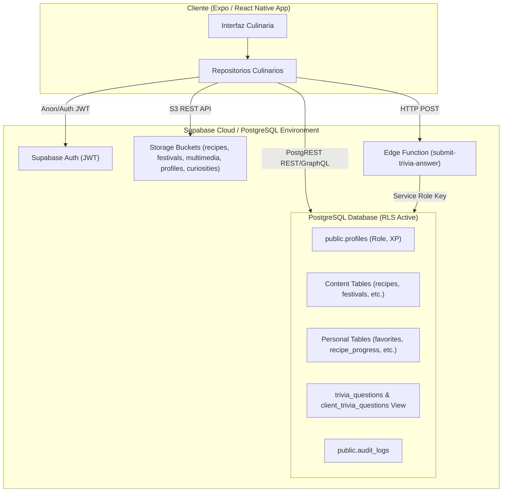

# Sabores 4.0 – Modelo de Amenazas y Superficie de Ataque (Threat Model)

> [!IMPORTANT]
> Este documento define el modelo de amenazas formal, la arquitectura de seguridad y la superficie de ataque expuesta por la aplicación **Sabores 4.0** en su integración con Supabase, PostgreSQL, Storage y Edge Functions.

---

## 1. Arquitectura & Componentes de la Aplicación

---

## 2. Superficie de Ataque Identificada

### A. Endpoints PostgREST & Vistas PostgreSQL
1. `public.profiles`
   - **Operaciones Expuestas**: `SELECT`, `UPDATE`
   - **Campos Sensibles**: `email`, `role` (user, editor, admin), `xp`, `level_title`.
   - **Vector de Riesgo**: Modificación directa de `role` o `xp` vía HTTP `PATCH` / PostgREST query.
2. `public.trivia_questions`
   - **Operaciones Expuestas**: `SELECT`
   - **Campos Sensibles**: `correct_answer_idx`.
   - **Vector de Riesgo**: Consulta directa sobre la tabla `trivia_questions` omitiendo la vista pública `client_trivia_questions`.
3. Tablas de Estado Personal (`favorites`, `recipe_progress`, `recently_viewed`, `trivia_history`, `viewed_hotspots`, `played_audios`, `read_curiosities`, `user_preferences`)
   - **Operaciones Expuestas**: `SELECT`, `INSERT`, `UPDATE`, `DELETE`
   - **Vector de Riesgo**: IDOR / Manipulación de `user_id` en peticiones `INSERT` o `UPDATE`.

### B. Supabase Storage Buckets
1. Buckets Públicos: `recipes`, `festivals`, `multimedia`, `curiosities`, `profiles`
   - **Vector de Riesgo**: Sobrescritura de archivos en `profiles` sin validación de prefijo de usuario (`auth.uid()`).

### C. Edge Functions
1. `submit-trivia-answer`
   - **Parámetros de Entrada**: `{ questionId, questionCode, selectedOptionIndex, userId }`
   - **Vector de Riesgo**: Falta de verificación de firma/JWT del invocador y posible suplantación de `userId` para inyectar puntajes en `trivia_history`.

---

## 3. Matriz de Amenazas (STRIDE)

| Categora STRIDE | Amenaza Identificada | Componente Afectado | Severidad | Estado Actual |
|---|---|---|---|---|
| **Spoofing** | Suplantación de identidad mediante manipulación del parámetro `userId` | Edge Function `submit-trivia-answer` | HIGH | Vulnerable |
| **Tampering** | Escalada de privilegios a 'admin' editando la propia fila en `profiles` | `public.profiles` (UPDATE policy) | CRITICAL | Vulnerable |
| **Tampering** | Alteración arbitraria de XP y título de nivel en la cuenta personal | `public.profiles` (UPDATE policy) | HIGH | Vulnerable |
| **Information Disclosure** | Lectura directa de `correct_answer_idx` desde `trivia_questions` | `public.trivia_questions` (SELECT policy) | MEDIUM | Vulnerable |
| **Tampering** | Sobrescritura de avatares de otros usuarios en el bucket `profiles` | `storage.objects` (INSERT policy) | MEDIUM | Vulnerable |
| **Elevation of Privilege** | Obtención no autorizada de rol 'editor'/'admin' para publicar contenido | `public.recipes`, `public.festivals` | CRITICAL | Vulnerable |
